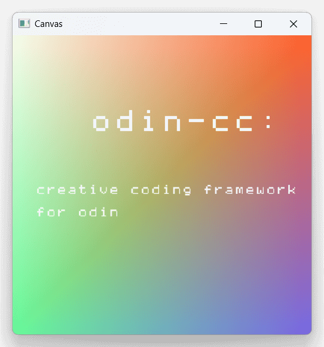

# odin-cc-examples



(code of above: [logo_icon](./logo-icon/main.odin))

> [!WARNING]
> Currently at very early stage. Please check [docs/coverage.md of odin-cc](https://github.com/cc4v/odin-cc/blob/main/docs/coverage.md).

Please install [odin-cc](https://github.com/cc4v/odin-cc) first.

## Usage

```bash
$ git clone https://github.com/cc4v/odin-cc-examples
$ cd odin-cc-examples
$ odin run hello_world
```

## Contribution

see [#Contribution](https://github.com/cc4v/odin-cc?tab=readme-ov-file#contribution) of [odin-cc](https://github.com/cc4v/odin-cc).
